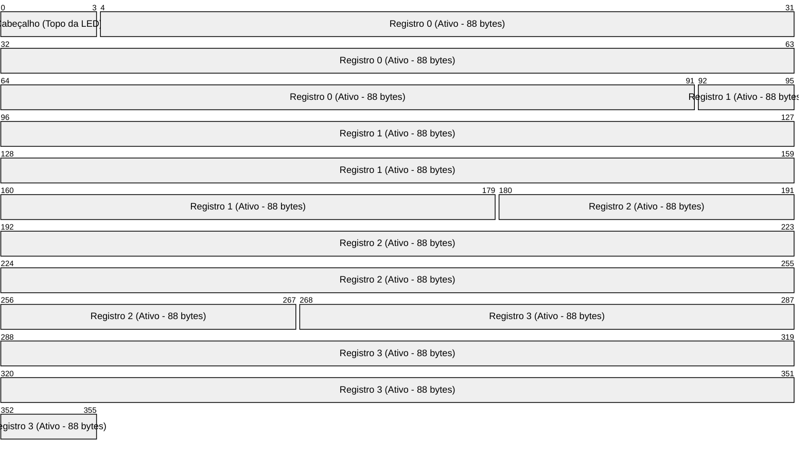

# Walkthrough do Motor de Persistência com LED

Este documento apresenta a análise de execução do motor de persistência em disco desenvolvido em C++ para o "Sistema de Rastreamento de Ativos e Inventário de TI".

## Estrutura do Arquivo em Disco

O arquivo `ativos_inventario.bin` possui a seguinte estrutura binária de baixo nível:



- **Cabeçalho (Offset 0 a 3)**: Um inteiro (`int`) de 4 bytes que guarda o RRN (Relative Record Number) do topo da LED. Se a lista de deletados estiver vazia, armazena `-1`.
- **Registros (Offset $4 + RRN \times 88$)**: Cada registro `Ativo` ocupa exatamente 88 bytes. O alinhamento é forçado a 1 byte por meio da diretiva `#pragma pack(push, 1)`.

---

## Estratégia de Codificação LED (Pilha LIFO)

Para economizar espaço e evitar a criação de um campo extra para controle lógico de remoção (como um booleano), o próprio campo `patrimonio_id` do registro é reaproveitado:

1. **Ativo**: `patrimonio_id >= 0`. O valor representa o ID real do ativo.
2. **Deletado**: `patrimonio_id < 0`. O valor é calculado a partir da fórmula:
   $$
   \text{patrimonio\_id} = -(\text{proximo\_rrn} + 2)
   $$

   - Se o próximo RRN da LED for `-1` (fim da pilha), `patrimonio_id` é `-1`.
   - Se o próximo RRN for `0`, `patrimonio_id` é `-2`.
   - Se o próximo RRN for `1`, `patrimonio_id` é `-3`.
   - ... e assim por diante.

Isso nos permite:

- Fazer varredura sequencial direta no arquivo físico e ignorar registros deletados com um simples teste: `if (reg.patrimonio_id < 0)`.
- Obter o próximo RRN disponível na LED fazendo: `proximo_rrn = -reg.patrimonio_id - 2`.

---

## Log de Execução dos Testes

O teste executado em `main.cpp` seguiu o seguinte fluxo:

1. **Inicialização**: O arquivo foi criado e os 4 bytes iniciais foram preenchidos com `-1`.
2. **Inserção**: Três ativos foram inseridos. Como a LED estava vazia (`topo = -1`), os ativos foram gravados no final do arquivo (RRNs 0, 1 e 2).
3. **Remoção**:
   - O Monitor (RRN 1) foi deletado. O topo da LED mudou para `1`. O registro no RRN 1 passou a guardar `patrimonio_id = -1` (fim da pilha).
   - O Notebook (RRN 0) foi deletado. O topo da LED mudou para `0`. O registro no RRN 0 passou a guardar `patrimonio_id = -3` (aponta para o RRN 1).
4. **Reaproveitamento (LIFO)**:
   - Novo ativo (ID 104) inserido: O sistema leu `topo = 0`, sobrescreveu o slot RRN 0 e atualizou o topo da LED para `1`.
   - Novo ativo (ID 105) inserido: O sistema leu `topo = 1`, sobrescreveu o slot RRN 1 e atualizou o topo da LED para `-1` (LED vazia).
   - Novo ativo (ID 106) inserido: LED vazia, registro adicionado ao fim do arquivo (RRN 3).

---

## Compilação e Execução

### Compilar

```powershell
g++ -O3 -std=c++17 main.cpp -o main.exe
```

### Executar

```powershell
.\main.exe
```
