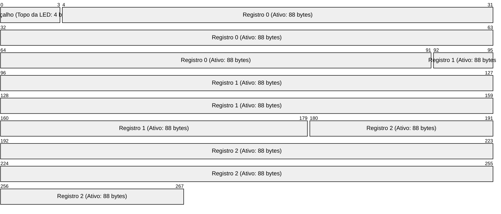
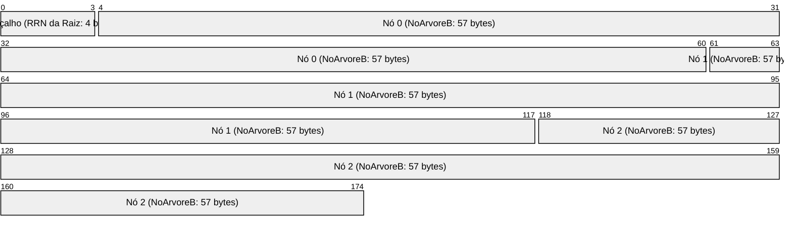

# Walkthrough do Motor de Persistência, Árvore B e Índice Secundário

Este documento apresenta a análise de execução do motor de persistência em disco em C++ para o **Sistema de Rastreamento de Ativos e Inventário de TI**, cobrindo o arquivo de dados com a LED, a Árvore B (índice primário) e o Índice Secundário com Lista Invertida (Loosely Binding).

---

## 📂 1. Estruturas de Arquivos e Lógica de Offsets

O sistema gerencia quatro arquivos físicos em disco, cada um com sua finalidade e layout binário específico de tamanho fixo. O empacotamento é controlado por `#pragma pack(push, 1)` para evitar padding de compilação.

### A. Arquivo de Dados Principal (`ativos_inventario.bin`)
Armazena os registros completos dos ativos e a Lista de Espaços Disponíveis (LED).
- **Tamanho do Registro**: 88 bytes (`Ativo`).
- **Cabeçalho**: 4 bytes (`int`), contendo o RRN do topo da LED (-1 se estiver vazia).
- **Cálculo de Offset**:
  $$\text{Offset Dados} = 4 + (\text{RRN} \times 88 \text{ bytes})$$



### B. Arquivo de Índice Primário - Árvore B (`ativos_index.btree`)
Armazena a Árvore B de ordem $m = 5$ em disco para buscas $O(\log N)$ pela chave primária (`patrimonio_id`).
- **Tamanho do Nó**: 57 bytes (`NoArvoreB`).
- **Cabeçalho**: 4 bytes (`int`), contendo o RRN da raiz atual da Árvore B.
- **Cálculo de Offset**:
  $$\text{Offset Árvore B} = 4 + (\text{RRN} \times 57 \text{ bytes})$$



### C. Arquivo de Índice Secundário (`tipo.sec`)
Armazena o mapeamento ordenado da chave secundária (`tipo_equipamento`) para o RRN inicial de sua lista correspondente em `tipo.inv`.
- **Modo**: Mantido ordenado na memória RAM em tempo de execução e salvo em disco no fechamento do sistema.
- **Tamanho do Registro**: 24 bytes (`IndiceSecundario`).
- **Cabeçalho**: Nenhum (carregamento sequencial até o fim do arquivo).
- **Cálculo de Offset**:
  $$\text{Offset Índice Sec} = N \times 24 \text{ bytes}$$


### D. Arquivo da Lista Invertida (`tipo.inv`)
Armazena os nós encadeados em disco que conectam as chaves secundárias aos IDs de patrimônio correspondentes.
- **Tamanho do Nó**: 8 bytes (`NoListaInvertida`).
- **Cabeçalho**: Nenhum (nós gravados diretamente a partir do offset 0 por *append*).
- **Cálculo de Offset**:
  $$\text{Offset Lista Inv} = \text{RRN} \times 8 \text{ bytes}$$


---

## 🔗 2. Estratégia de Loosely Binding (Ligação Tardia)

O sistema adota **Loosely Binding** para o índice secundário. Isso significa que a lista invertida (`tipo.inv`) armazena a **chave primária** (`patrimonio_id`) em vez do RRN físico ou offset direto do registro de dados.

### Fluxo de Funcionamento
1. **Busca**: 
   - Procuramos pelo `tipo_equipamento` no índice secundário em RAM.
   - Encontrando a entrada, obtemos a cabeça da lista (`rrn_lista`).
   - Percorremos a lista invertida no arquivo `tipo.inv` em disco, lendo os `patrimonio_id`s de nó em nó.
   - Para cada `patrimonio_id`, consultamos a **Árvore B** (índice primário) para obter o RRN de dados atualizado.
   - Lemos o registro no RRN retornado e confirmamos que ele está ativo (`patrimonio_id >= 0`).

### Vantagens Didáticas para a Avaliação
- **Consistência na Deleção e Reaproveitamento**: Quando um ativo é removido ou sobrescrito na LED (mudando seu RRN físico), o índice secundário e o arquivo `.inv` **não precisam ser reescritos ou reorganizados**. A Árvore B e a verificação `esta_removido` filtram naturalmente qualquer registro deletado, eliminando inconsistências imediatas.

---

## 📈 3. Log de Execução dos Testes (`teste_secundario.cpp`)

O fluxo do script de testes simula o comportamento completo do SGBD:

1. **Inserção com Encadeamento**:
   - Foram inseridos 6 registros. Os tipos `"Notebook"` (IDs 101, 103, 106) e `"Monitor"` (IDs 102, 105) possuem repetições.
   - No arquivo `tipo.inv`, a inserção realiza um **prepend** (insere na cabeça), resultando na ordem inversa de inserção:
     - Busca por `"Notebook"` retorna IDs: `[106, 103, 101]`.
     - Busca por `"Monitor"` retorna IDs: `[105, 102]`.

2. **Loosely Binding na Remoção**:
   - O Notebook HP (ID 103) é removido. Ele é marcado como deletado no arquivo de dados e inserido no topo da LED.
   - Na busca subsequente por `"Notebook"`, a lista invertida ainda lê o ID `103`, mas o resolvedor da Árvore B / leitura de dados detecta que o registro está logicamente deletado (`patrimonio_id < 0`), ignorando-o de forma segura.

3. **Reaproveitamento de Espaço (LIFO)**:
   - Um novo Notebook (ID 107) é inserido. O sistema desempilha o RRN 1 da LED e grava o novo registro lá.
   - A busca por `"Notebook"` agora reflete a inclusão do ID `107` no RRN 1, restabelecendo a consistência automaticamente.

4. **Persistência de Fechamento**:
   - Ao fechar, o índice secundário da RAM é ordenado alfabeticamente e gravado em `tipo.sec`.
   - Na reinicialização do sistema, o arquivo `tipo.sec` é lido de volta para a RAM, estando pronto para novas buscas rápidas sem a necessidade de varredura sequencial.

---

## ⚙️ Compilação e Execução

### Usando o Script Auxiliar (Recomendado)
```powershell
# Executa a compilação via g++ e roda o programa de testes automaticamente
.\compilar.ps1
```

### Manualmente via PowerShell/Terminal
```powershell
# Compilar o teste integrado
g++ -O3 -std=c++17 teste_secundario.cpp -o teste_secundario.exe

# Executar o programa de testes
.\teste_secundario.exe
```
